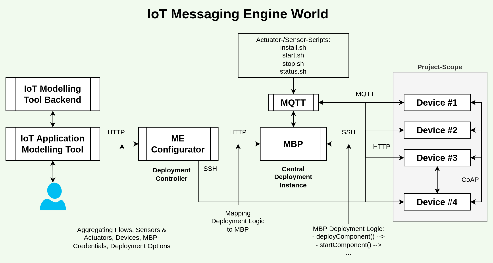

# PIME 2 Documentation

This is a technical documentation about Messaging Engine 2 (ME 2).
This repository is an artifact of a Forschungsprojekt during summer 2022.
The main goal of this project is to rewrite "PIME" (ME 1) to a new version and to document
the existing code and ideas. But there are also some new ideas...

### IoT Messaging Engine World

Note: ME 2 is located at the end of a chain of other software systems which are out-of-scope
for this project.

## Content

- [Endpoints](concepts/Endpoints.md)
- [Flows](concepts/Flows.md)
- [Flow Messages](concepts/Flow_Message.md)

## Processes

- **PIME Deployment:** The whole software is getting rolled out
- **Data Flow Model Deployment:** A Data Flow Model is rolled out
- **Ping Request:** Connecting to "Hello" endpoint
- **Neighbor Provisioning:** The system gets information about a (new) ME2-neighbor-instance
- **Flow/Operation Provisioning:** The system gets information about the operation(s) it should work with
- **[Message Sending](./concepts/Flow_Message.md):** The system receives a message with (arbitrary) payload
- **System Health Metrics:** The system provides information about its state

## Concepts

### Multi-Sensor-Support

### Messaging

#### (Discrete) Message Payloads

#### Message-Validation (syntactic + semantic)

#### Message Prioritization

### Neighbor Discovery/Dynamic Network

"Heartbeat"

### Monitoring, Observability

### Availability

### Integration with MEConfigurator, MBP + Data Flow Modelling Tool

### Simulation / Benchmarking

### Failover-Concepts

## Diagrams

Download `plantuml.jar` [here](https://github.com/plantuml/plantuml/releases).

To (re-)generate the diagrams copy a `plantuml.jar` in `./diagrams` and execute `generate_diagrams.sh`.

- [PlantUML](http://plantuml.com)
- [PlantUML cli usage](http://plantuml.com/de/command-line)